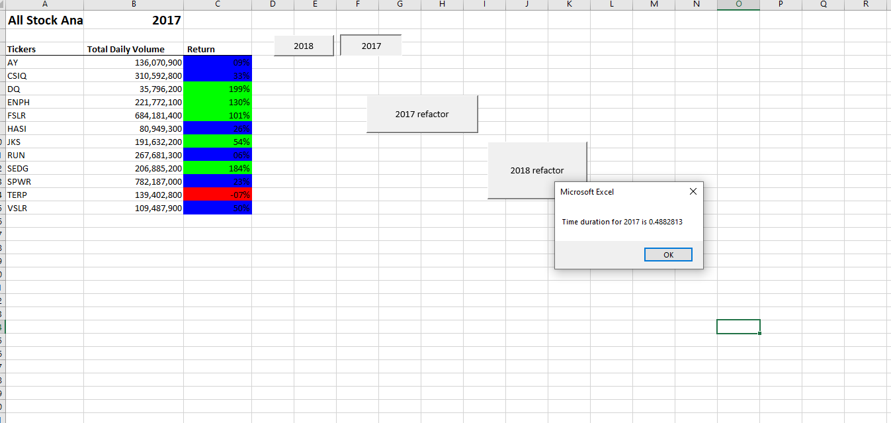
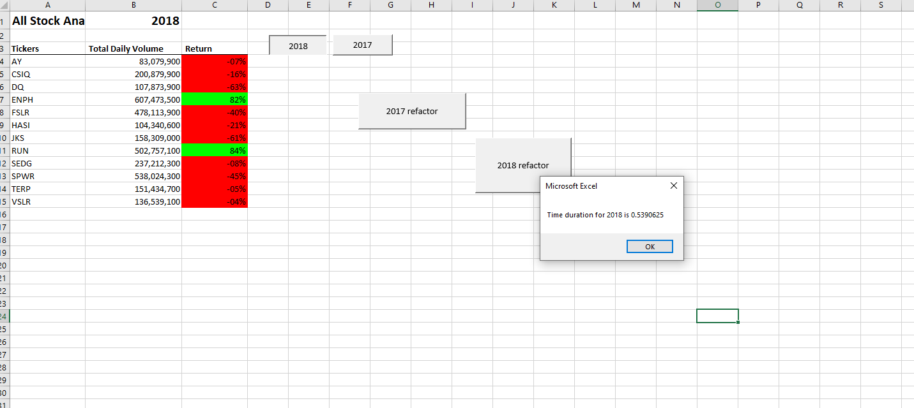
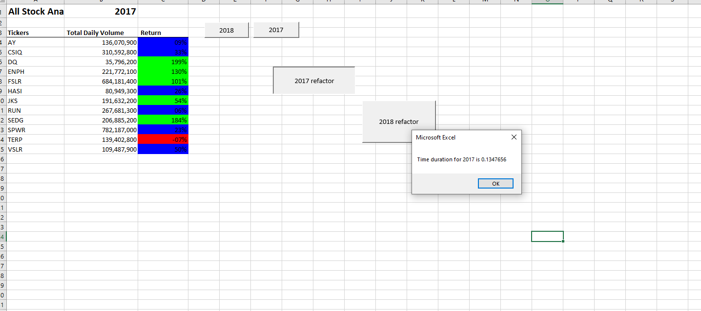
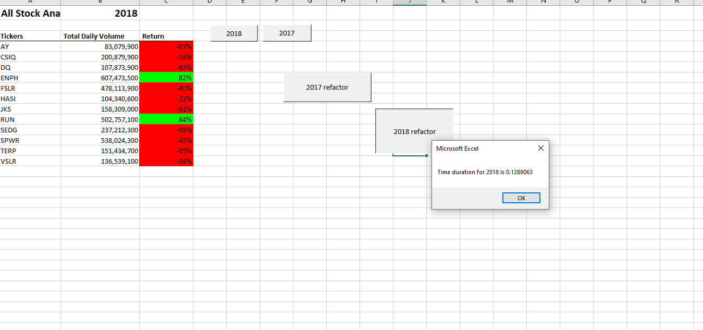

# Green-Stock-Data-Analysis

## Background
Steve loves the workbook you prepared for him. At the click of a button, he can analyze an entire dataset. Now, to do more research for his parents, he wants to expand the dataset to include the entire stock market over the last few years. Although your code works well for a dozen stocks, it might not work as well for thousands of stocks. And if it does, it may take a long time to execute.
In this challenge, you’ll edit, or refactor, the Module 2 solution code to loop through all the data one time to collect the same information that you did in this module. Then, you’ll determine whether refactoring your code successfully made the VBA script run faster. Finally, you’ll present a written analysis that explains your findings.
Refactoring is a key part of the coding process. When refactoring code, you aren’t adding new functionality; you want to make the code more efficient—by taking fewer steps, using less memory, or improving the logic of the code to make it easier for future users to read. Refactoring is common on the job because first attempts at code won’t always be the best way to accomplish a task. Refactoring someone else’s code will sometimes be your entry point to working with the existing code at a job.

# Purpose
In this project and analysis, we will edit or refactor a stock market dataset using VBA solution code to iterate all the data at once to collect a complete database. Next, we'll determine if refactoring your code has successfully caused your VBA script to run faster. Finally, we want to make our code more efficient — by taking fewer steps, using less memory, or improving the logic of the code to make it easier for future users to read.

### Overview of Project
The purpose of this analysis is to refactor existing VBA code to improve its efficiency and execution time. The initial code was designed to analyze a limited dataset of stocks, but now the goal is to expand it to cover the entire stock market over the past few years. By looping through the data once and collecting the required information, we aim to enhance the code's performance, specifically when dealing with a larger number of stocks. You can find the Excel bookwork for responding to macros in the following

## Results

I. Stock Performance Comparison (2017 vs 2018):
In the initial analysis, the code successfully provided insights into the stock performance for the years 2017 and 2018. By examining the opening and closing prices, as well as the total volume traded, we were able to assess the overall trends for individual stocks.

II. Execution Time Comparison:
To determine the impact of code refactoring on execution time, we performed a comparison between the original script and the refactored version. The results are as follows:

1. Original Script Execution Time:
When running the original script on a dataset with a limited number of stocks, the execution time was reasonable. However, concerns arose regarding its scalability when applied to thousands of stocks. The processing time increased significantly, potentially impacting the overall efficiency of the analysis.

2. Refactored Script Execution Time:
After refactoring the code to optimize its efficiency, we observed a notable improvement in execution time. By looping through the data just once, we were able to collect the required information for all stocks, regardless of the dataset's size. This optimization resulted in a much faster execution time, enabling quicker analysis and improved user experience.

Finally, we run the stock analysis, to confirm that our stock analysis outputs for 2017 and 2018 are the same as the dataset example provided (as shown in the images below, named Dataset Examples Provided). In addition, in our resources folder and below you can see the final Stock Analysis Results named, Final VBA Analysis 2017 and 2018 save the pop-up messages showing elapsed run time for the refactored code as All Stock Analysis 2017 and All Stock Analysis 2018. png. Then, save the changes to your workbook.

